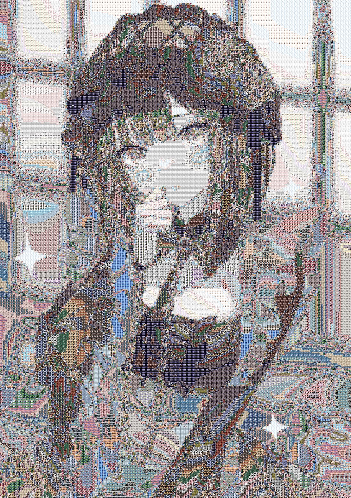

# pyPhotoMosaic
pyPhotoMosaic lets you create photomosaics in a few steps.

<br>Trying to optimise the efficiency of the code to reduce build time.
## Example:
### Original & Output (CV2)
<p float="left">

</p>

### Original & Output (PIL)
<p float="left">

</p>

Artist: 
<a href="https://www.pixiv.net/artworks/96381546">https://www.pixiv.net/artworks/96381546</a>

## Updated to use pure OpenCV for image manipulation
Benchmark Params: `TILE_SIZE = 80`, `ENLARGE_FACTOR = 8`, `REUSE_CACHE = FALSE`

- Old PIL processing time: 3m 03.70s total
- New CV2 processing time: 2m 14.98s total


## Prerequisites

- numpy
- cv2

## Usage

Windows:
```console
python pMos.py <target_image> <image tiles folder> <output_filename>
```

Linux & macOS:
```console
python3 pMos.py <target_image> <image tiles folder> <output_filename>
```

It might take a while to create a the Photo Mosaics.

## Parameters
- `TILE_SIZE` (Mosaic Tiles' sizes in pixels)
- `CACHE_DIR` (Mosaic Tiles' cache directory)
- `TARGET_CACHE_DIR` (Target Image's cache directory)
- `REUSE_CACHE` (`True` to reuse the cache, `False` to regenerate cache)
- `ENLARGE_FACTOR` (Factor to enlarge the image)

